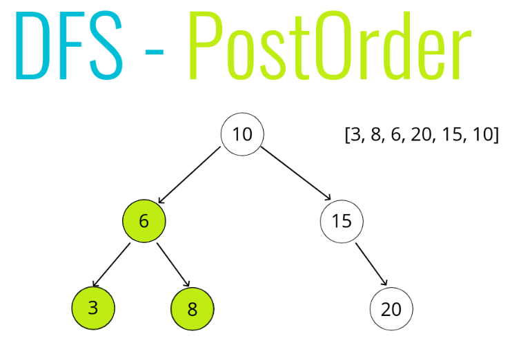
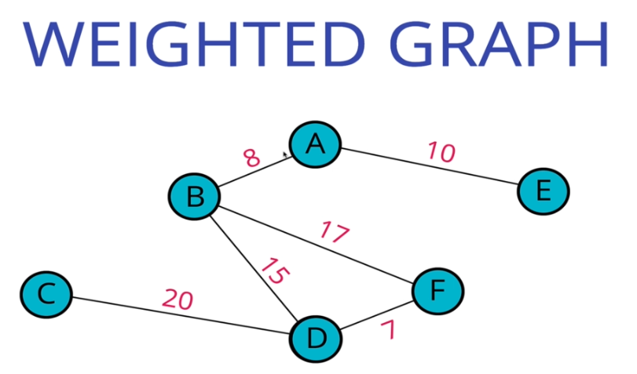

# Algorithm notes:-

### How to run the solution?
- `npm start` and select the program you want to run.
- `npm test` to run all tests.

## Basics

### Frequency counter pattern
1. Two arrays [1,2,2,5] and [1,4,25,4] find if the second array is exact square of first.
2. Count the frequency of each element in both the arrays
3. Then match the frequency
4. Same is applicable to strings, find if 2 strings are same, 'querty' and 'uyterq'

### Multiple counter pattern
1. Given a sorted array [-3,-2,-1,0,2,4], find the first pair whose sum is 0.
2. Start 2 pointers, left and right, one at the beginning and one at the end.
3. If arr[left] + arr[right] < 0, increment left.
4. If arr[left] + arr[right] > 0, increment right.
5. The idea is simple, if the sum goes high on positive side, decrement right pointer, if sum goes on negative side, increment left counter, to sort of converge at the middle.

##### Another example,
1. Given an array [1,1,1,2,2,3,3,3,5,6,7,7,10], find the number of unique elements in it.
2. Start 2 pointers, root = array[0] and scout = array[1].
3. Add root to result as a first element.
4. Compare root and scout. If they are same increment scout.
5. If they are different, add root to result.
6. Do this till scout runs through entire array
Note- One variation, for above implementation space complexity is O(n). To avoid that, same array can be manipulated. In that case, the position of root after running the algorithm, will give the unique elements.

### Sliding window pattern
1. Given any array and a value N, we have to find the sub-array and the maximum sum of N consecutive elements in that array.
2. Brute force would be to loop through all the elements and find the sum of next N integers. But this is a problem if array is very large.
3. Better approach is, starting at 0 index, find the sum of N elements, and set a temporary max sum.
4. Next we run through the array again and keep subtracting an element and add the next element.
5. Effectively we are moving the window forward.
6 If we find a sum greater than temp max sum, we update it.

### Recursion
1. Has 2 elements :- A base case & a function that calls itself, with a reducing set of input to recursive call.
2. Helper method recursion is a pattern that is used when we want to collect the results in an collection.

## Search

### Linear search
1. Loop through all the elements, compare each element.

**(Skipping for now, we'll come back to this)**

### Linked lists

1. Linked lists are like stairs and Arrays are like a lift. In array(lift) you can say take me to 5th floor, and it will directly take you there, but in linked list, you have to traverse like a stair, first floor, then second, then third, fourth, then fifth.
2. There is no index. Linked lists is a bunch of nodes, holding each other.
3. Linked list have only 3 properties, head tail and length.
4. Difference between arrays and lists.
    #### Lists 

    a. Do not have indexes!
    b. Connected via nodes with a next pointer
    c. Random access is not allowed

    #### Arrays

    a. Indexed in order!
    b. Insertion and deletion can be expensive
    c. Can quickly be accessed at a specific index.
    
5. Operations:
    
    #### Push
    Add a new item in the end.
    1. This function should accept a value
    2. Create a new node using the value passed to the function
    3. If there is no head property on the list, set the head and tail to be the newly created node
    4. Otherwise set the next property on the tail to be the new node and set the tail property on the list to be the newly created node
    5. Increment the length by one
    6. Return the linked list

    #### Pop
    Remove the last item.
    1. If there are no nodes in the list, return undefined
    2. Loop through the list until you reach the tail
    3. Set the next property of the 2nd to last node to be null
    4. Set the tail to be the 2nd to last node
    5. Decrement the length of the list by 1
    6. Return the value of the node removed

    #### Shift
    Removing a new node from the beginning of the Linked List
    1. If there are no nodes, return undefined
    2. Store the current head property in a variable
    3. Set the head property to be the current head's next property
    4. Decrement the length by 1
    5. Return the value of the node removed

    #### Unshift
    Add a new head
    1. This function should accept a value
    2. Create a new node using the value passed to the function
    3. If there is no head property on the list, set the head and tail to be the newly created node
    4. Otherwise set the newly created node's next property to be the current head property on the list
    5. Set the head property on the list to be that newly created node
    6. Increment the length of the list by 1
    7. Return the linked list

    #### Get an element
    Retrieving a node by it's position in the Linked List!
    1. This function should accept an index
    2. If the index is less than zero or greater than or equal to the length of the list, return null
    3. Loop through the list until you reach the index and return the node at that specific index

    #### Set an element at given index
    Changing the value of a node based on it's position in the Linked List
    1. This function should accept a value and an index
    2. Use your get function to find the specific node.
    3. If the node is not found, return false
    4. If the node is found, set the value of that node to be the value passed to the function and return true

    #### Insert 
    Adding a node to the Linked List at a specific position
    1. If the index is less than zero or greater than the length, return false
    2. If the index is the same as the length, push a new node to the end of the list
    3. If the index is 0, unshift a new node to the start of the list
    4. Otherwise, using the get method, access the node at the index - 1
    5. Set the next property on that node to be the new node
    6. Set the next property on the new node to be the previous next
    7. Increment the length
    8. Return true

    #### Remove
    1. If the index is less than zero or greater than the length, return undefined
    2. If the index is the same as the length-1, pop
    3. If the index is 0, shift
    4. Otherwise, using the get method, access the node at the index - 1
    5. Set the next property on that node to be the next of the next node
    6. Decrement the length
    7. Return the value of the node removed

    #### In-place Reverse
    ```
        node = this.head
        previous = null
        next = null

          100      101     102     103     104
    1.    node     next
    2.    prev     node    next
    3.             prev    node    next
    4.                     prev    node   next
    5.                             prev   node   next    
    
        loop{
            next = node.next
            node.next = prev
            node = next
            prev = node
        }
    ```

### Doubly linked list

**We'll come back to this section, skipping for now**

### Stacks

A LIFO data structure! The last element added to the stack will be the first element removed from the stack, like a pile of books.

Stacks are use in - 
1. Managing function invocations
2. Undo / Redo
3. Routing in web frameworks. All visited addresses are maintained on stack. The return URL is the top item on stack.

**Trick** - Stack and queue can be simply implemented using built-in array data structure in JS. 
1. Push/pop - will give Stack
2. Unshift/shift - will give Queue

#### Operations - 

**Stack only has 2 operations - Push and Pop. Note that both these operations should be constant time.**

**Note** - We will be implementing Stack using Linked list. Push and Pop in linked list are not constant time. So we will use Shift and Unshift and maintain the list in reverse order.

```
First   D
        C
        B
Last    A

```

#### Push
1. The function should accept a value
2. Create a new node with that value
3. If there are no nodes in the stack, set the first and last property to be the newly created node 
4. If there is at least one node, create a variable that stores the current first property on the stack
5. Reset the first property to be the newly created node
6. Set the next property on the node to be the previously created variable
7. Increment the size of the stack by 1

#### Pop
1. If there are no nodes in the stack, return null
2. Create a temporary variable to store the first property on the stack
3. If there is only 1 node, set the first and last property to be null
4. If there is more than one node, set the first property to be the next property on the current first
5. Decrement the size by 1
6. Return the value of the node removed

### Queue
First in - first out data structure. Like waiting in line.

Used in -
1. Background tasks
2. Uploading resources
3. Sending pages to a printer.

There are 2 ways to implement queues - 
1. Push and Shift
2. Unshift and pop.

Shift causes the entire array to re-index. However, pop simply pops the last element. So 2nd approach is constant time for pop operation, but again Unshift will cause the entire array to reindex, when we add an element in the beginning.

So a better approach, is to add at the end, and remove from the beginning, then this would be constant time for both operations.

```
1
1   2
1   2   3
1   2   3   4

And then simply pop from beginning.
```

### Operations

#### EnQueue
1. This function accepts some value
2. Create a new node using that value passed to the function
3. If there are no nodes in the queue, set this node to be the first and last property of the queue
4. Otherwise, set the next property on the current last to be that node, and then set the last property of the queue to be that node
5. Increment the size of the queue by 1

#### Dequeue
1. If there is no first property, just return null
2. Store the first property in a variable
3. See if the first is the same as the last (check if there is only 1 node). If so, set the first and last to be null
4. If there is more than 1 node, set the first property to be the next property of first 
5. Decrement the size by 1
6. Return the value of the node dequeued

### Trees 

A data structure that consists of nodes in a parent / child relationshipIf we think. Linked list if the special type of tree.

Tree can also represented as a Graph, where there exists only one path to navigate between 2 nodes.

#### Terminology - 
- **Root** - The top node in a tree.
- **Child** -A node directly connected to another node when moving away from the Root.
- **Parent** - The converse notion of a child.
- **Siblings** -A group of nodes with the same parent.
- **Leaf** - A node with no children.
- **Edge** - The connection between one node and another

#### Uses
1. DOM is a tree.
2. Network Routing
3. Abstract syntax trees (Compiler) 
4. Directory structure.
5. Json

*Refer - [List of all data structures](https://en.wikipedia.org/wiki/List_of_data_structures)*

#### Binary Search tree.

**Binary tree** - Tree in which each node has at most 2 children
**Binary search tree** - Refer rules below.
Rules - 

1. Every parent node has at most two children
2. Every node to the left of a parent node is always less than the parent
3. Every node to the right of a parent node is always greater than the parent

#### Why use BST?
Binary search tree has Big O complexity of Log n, and is therefore preferable.

### Operations:

#### Insert a new node

1. Create a new node
2. Starting at the root
    - Check if there is a root, if not - the root now becomes that new node!
    - If there is a root, check if the value of the new node is greater than or less than the value of the root
    - If it is greater 
        - Check to see if there is a node to the right
            - If there is, move to that node and repeat these steps
            - If there is not, add that node as the right property
    - If it is less
        - Check to see if there is a node to the left
            - If there is, move to that node and repeat these steps
            - If there is not, add that node as the left property

#### Finding a node

- Starting at the root
    - Check if there is a root, if not - we're done searching!
    - If there is a root, check if the value of the new node is the value we are looking for. If we found it, we're done!
    - If not, check to see if the value is greater than or less than the value of the root
    - If it is greater 
        - Check to see if there is a node to the right
            - If there is, move to that node and repeat these steps
            - If there is not, we're done searching!
    - If it is less
        - Check to see if there is a node to the left
        - If there is, move to that node and repeat these steps
        - If there is not, we're done searching!

### Tree traversals
Visit each node. There are 2 ways to traverse a tree.

#### Breadth first search
   
```
        ------> 10
------> 6       ------>15
--->3   --->8          --->20

```
Iterations - 

```
                    10
            6               15
        3       8               20

**Iteration 1**:

Start with root

To-Do Queue : [10]
Visited : []

**Iteration 2**:

Dequeue next item from the list and add the children of current item in to-do list in the queue, left and then right.

To-Do Queue : [6, 15]
Visited : [10]

**Iteration 3**:

Go on... repeat this process...

To-Do Queue : [15, 3, 8]
Visited : [10, 6]

**Iteration 4**:

Next...

To-Do Queue : [3, 8, 20]
Visited : [10, 6, 15]


**Iteration 5**:

Next... 3 doesn't have any children

To-Do Queue : [8, 20]
Visited : [10, 6, 15, 3]


**Iteration 6**:

Next...

To-Do Queue : [20]
Visited : [10, 6, 15, 3, 8]


**Iteration 7**:

Next...

To-Do Queue : []
Visited : [10, 6, 15, 3, 8, 20]

When to-do is empty, return the visited array.

```


##### Algorithm
- Create a queue (this can be an array) and a variable to store the values of nodes visited
- Place the root node in the queue
- Loop as long as there is anything in the queue
    - Dequeue a node from the queue and push the value of the node into the variable that stores the nodes
    - If there is a left property on the node dequeued - add it to the queue
    - If there is a right property on the node dequeued - add it to the queue
- Return the variable that stores the values

#### Depth first search

##### Pre-order traversal:


**Iteration 1**:


**Iteration 2**:


**Iteration 3**:


**Iteration 4**:


**Iteration 5**:


**Iteration 6**:


##### Post-order traversal:


**Iteration 1**:


**Iteration 2**:


**Iteration 3**:


**Iteration 4**:


**Iteration 5**:


**Iteration 6**:


**Side note** - We accidentally did this (due to an immature copy-paste) - 

``` 
recursive_postOrder(current: TreeNode, visited:any[]): any[] {
        
        if(current.left)
            this.recursive_preOrder(current.left, visited);
        
        if(current.right)
            this.recursive_preOrder(current.right, visited);
        
        visited.push(current.value);
        
        return visited;
    }

Note the recursive function called inside (it's pre-order).

The output was - [ 6, 3, 8, 15, 20, 10 ]

This is an interesting output. We have tuples here of (Parent, left, right), with Root at the end. 
```

##### In-order traversal:

**Iteration 1**:


**Iteration 2**:


**Iteration 3**:


**Iteration 4**:


**Iteration 5**:


### BFS vs DFS

1. Time complexity is same for both. 
2. If the tree is completely filled, and wide, and deep, then BFS will have more space complexity, since we maintain a queue. Ultimately, the queue will be 0, but it can hold lot of elements while running. 

### In-order vs Pre-order vs Post-order
1. If you want a sorted array then In-order is useful. 

### Binary heaps

Very similar to a binary search tree, but with some additional rules!
1. In a MaxBinaryHeap, parent nodes are always larger than child nodes. 
2. In a MinBinaryHeap, parent nodes are always smaller than child nodes

#### Max Binary Heap

1. Each parent has at most two child nodes
2. The value of each parent node is always greater than its child nodes
3. In a max Binary Heap the parent is greater than the children, but there are no guarantees between sibling nodes.
4. A binary heap is as compact as possible. All the children of each node are as full as they can be and left children are filled out first

Example - 
**Max binary Heap** - 


#### Min binary heaps

Example - 


#### Why heaps?

1. Binary Heaps are used to implement Priority Queues, which are very commonly used data structures

2. They are also used quite a bit, with graph traversal algorithms

#### Data model

Binary heaps are usually represented using an Array or Linked list data structure.


#### Adding to a Max binary heap


#### PSEUDO CODE

- Push the value into the values property on the heap
- Bubble the value up to its correct spot!
- Create a variable called index which is the length of the values property - 1
- Create a variable called parentIndex which is the floor of (index-1)/2
- Keep looping as long as the values element at the parentIndex is less than the values element at the child index
    - Swap the value of the values element at the parentIndex with the value of the element property at the child index
    - Set the index to be the parentIndex, and start over!

#### Extract Max, Remove element from heap.
This operation has many names. 
Wiki says, The procedure for deleting the root from the heap (effectively extracting the maximum element in a max-heap or the minimum element in a min-heap) and restoring the properties is called down-heap (also known as bubble-down, percolate-down, sift-down, trickle down, heapify-down, cascade-down, and extract-min/max).

#### Operation


#### PSEUDO CODE
- Swap the first value in the values property with the last one
- Pop from the values property, so you can return the value at the end.
- Have the new root "sink down" to the correct spot...​
    - Your parent index starts at 0 (the root)
    - Find the index of the left child: 2 * index + 1 (make sure its not out of bounds)
    - Find the index of the right child: 2 * index + 2 (make sure its not out of bounds)
    - If the left or right child is greater than the element...swap. If both left and right children are larger, swap with the largest child.
    - The child index you swapped to now becomes the new parent index.  
    - Keep looping and swapping until neither child is larger than the element.
    - Return the old root!

### Priority Queue
Priority queues are commonly implemented using Binary Heaps (min or max, doesn't matter).

Basically the idea is that each element has a priority. Elements with higher priorities are served before elements with lower priorities. And the element with highest priority is always maintained at the Root. So when we want to serve (ExtractMax) we just do it using extractMax and re-balance the tree.

Naive approaches using linked list or array are O(n), however, using Binary heaps, it is always O(log(n)).

For implementing 'Priority queue' using Binary heap, we do operations on an object instead of number. The object has a Priority field, which is used in Insert() and extractMax() operations.

### Hash tables

Hash tables are used to store key-value pairs. They are like arrays, but the keys are not ordered.

Unlike arrays, hash tables are fast for all of the following operations: finding values, adding new values, and removing values!

Nearly every programming language has some sort of hash table data structure. Because of their speed, hash tables are very commonly used!

Hash tables maps keys to objects. The underlying data structures in a has table is an array. When we pass in a key to a has table, it converts that key into an index that can be used to access the object which is stored in the array.


The important key here is the **HASH FUNCTION** which translates a key into an index, during retrievel and insert.

Below are the characteristics of a HASH FUNCTION - 

1. Fast (i.e. constant time)
2. Doesn't cluster outputs at specific indices, but distributes uniformly
3. Deterministic (same input yields same output)

Prime numbers are good friends of hash functions. They help in uniform distribution of hashes. This is a research topic.

When hash functions produce same index for 2 or more different set of inputs, it leads to **Collisions**.

There are 2 ways to address collisions:
1. Linear probing.
2. Separate chaining.

#### Separate chaining

With separate chaining, at each index in our array we store values using a more sophisticated data structure (e.g. an array or a linked list).

This allows us to store multiple key-value pairs at the same index.


#### Operations with separate chaining

1. set
    - Accepts a key and a value
    - Hashes the key
    - Stores the key-value pair in the hash table array via separate chaining
2. get
    - Accepts a key
    - Hashes the key
    - Retrieves the key-value pair in the hash table
    - If the key isn't found, returns undefined

#### Linear probing

With linear probing, when we find a collision, we search through the array to find the next empty slot.

Unlike with separate chaining, this allows us to store a single key-value at each index.


### Graphs

A graph data structure consists of a finite (and possibly mutable) set of vertices or nodes or points, together with a set of unordered pairs of these vertices for an undirected graph or a set of ordered pairs for a directed graph.

Basically, it's just a collection of nodes and connections.

Used in - 
1. Social Networks
2. Location / Mapping
3. Routing Algorithms
4. Visual Hierarchy
5. File System Optimizations
6. EVERYWHERE!

#### Terminology

- **Vertex** - a node
- **Edge** - connection between nodes
- **Weighted/Unweighted** - values assigned to distances between vertices
- **Directed/Undirected** - directions assigned to distanced between vertices

#### Undirected Graphs

In undirected graphs, there is no polarity to edges. For example, Facebook. If 2 people are friends, they both share each others content, it's mutual.


#### Directed graph

In directed graphs, there is a direction associated between any two connected nodes. In below diagram, A and B are connected, we can go from B to A, **but not vice-versa**.


For example, Instagram or Twitter. People follow others, but the people they follow, might not follow them back.


**Facebook is a undirected graph, Instagram, Twitter are directed graphs**

#### Weighted graph

Weighted graph is the one in which each edge has a weight associated with it.



#### Un-Weighted graph

As the name suggests, the edges do not have a weight associated.

### How do we represent information in graphs?

#### Adjacency Matrix


- **1** - Represents a connection between any two nodes.
- **0** - Represents no connection.

- **A - B** is 1
- **B - A** is also 1, representing that this is an undirected graph. **Directed graph will not necessarly have a connection both ways.**

#### Adjacency list


If we want to find the nodes connected to node 3 for example, 
- we can go to the 3rd index
- there we can find the nodes connected to 3.

This implementation was easy, but it has flaws:-
1. It worked well, since the nodes were numbers, but they could be anything, strings, letters, complex objects.
2. Even for number implementation, if there are huge gaps in numbers, we will have a lot of empty elements in the array/list.

##### Better approach


Adjaency list can take advantage of **hash table**, by storing 
- the value of node as a key 
- and connected nodes as value of hash table.

In this example, we look for "A", and that gives us the nodes connected to "A".

#### Big O comparison of Adjacency matrix and Adjacency list.


- For Adding a new node, we need to add a new row and new column to Adjacency Matrix, it is therefore O(V^2), since it is a 2-dimentional structure.
- Whereas for adjacency list, it's just adding a new key-value pair.

More key diffrences below - 


#### Operations

1. Add Node/vertex
    - Simple, just add a key-value pair to the HashMap, with key as value of node, and value as an empty array.

```
graph.addVertex("Tokyo")
{
    "Tokyo": []
}
```

2. Add edge between 2 nodes/vertices.
    - This function should accept two vertices, we can call them vertex1 and vertex2
    - The function should find in the adjacency list the key of vertex1 and push vertex2 to the array
    - The function should find in the adjacency list the key of vertex2 and push vertex1 to the array

```
{
  "Tokyo": [],
  "Dallas": [],
  "Aspen": []
}
        |
        |
        |
        V

g.addEdge("Tokyo", "Dallas")

        |
        |
        |
        V

{
  "Tokyo": ["Dallas"],
  "Dallas": ["Tokyo"],
  "Aspen": []
}

        |
        |
        |
        V

g.addEdge("Dallas", "Aspen")

        |
        |
        |
        V

{
  "Tokyo": ["Dallas"],
  "Dallas": ["Tokyo", "Aspen"],
  "Aspen": ["Dallas"]
}
```

3. Removing an edge
    - This function should accept two vertices, we'll call them vertex1 and vertex2
    - The function should reassign the key of vertex1 to be an array that does not contain vertex2
    - The function should reassign the key of vertex2 to be an array that does not contain vertex1

```
g.removeEdge("Tokyo", "Dallas")
 
        |
        |
        |
        V

{
  "Tokyo": ["Dallas"],
  "Dallas": ["Tokyo", "Aspen"],
  "Aspen": ["Dallas"]
}
 
        |
        |
        |
        V

{
  "Tokyo": [],
  "Dallas": ["Aspen"],
  "Aspen": ["Dallas"]
}
```

4. Remove vertex
    - The function should accept a vertex to remove
    - The function should loop as long as there are any other vertices in the adjacency list for that vertex
    - Inside of the loop, call our removeEdge function with the vertex we are removing and any values in the adjacency list for that vertex
    - delete the key in the adjacency list for that vertex
  
  

#### Tree traversals

    - Peer to peer networking
    - Web crawlers
    - Finding "closest" matches/recommendations
    - Shortest path problems
        - GPS Navigation
        - Solving mazes
        - AI (shortest path to win the game)

##### Use cases 

Graphs are widely used in recommendation engines. Let's look at the example below,

Let's say we have a graph like this, and we want to recommend movies to a user based on genre. User who likes movie 'Halo', can be recommended 'Borderlands', since they have common genres.


Another example, Let's say we want to give friend recommendations

Maria is friends with Nan. Armie is also friends with Nan. 

Both Maria and Armie are also friends with Tim. So it is very likely that Tim is also friends with Nan. 


#### DEPTH FIRST TRAVERSAL 

A Graph, unlike a Tree does not have a root. We therefore have to remember the nodes we have visited. 

Below illustration, can help visualize DFS.


##### Steps (Recursive)
    - The function should accept a starting node
    - Create a list to store the end result, to be returned at the very end
    - Create an object to store visited vertices
    - Create a helper function which accepts a vertex
        - The helper function should return early if the vertex is empty
        - The helper function should place the vertex it accepts into the visited object and push that vertex into the result array.
        - Loop over all of the values in the adjacencyList for that vertex
        - If any of those values have not been visited, recursively invoke the helper function with that vertex
    - Invoke the helper function with the starting vertex
    - Return the result array

##### PSUDOCODE


```
/// DFS Recursive
dfs_recursive(startingNode: string): any {
        const result = [];
        const visited = [];
        const adjacencyList = this.adjacencyList; // Gotcha

        (function dfs(vertex: string) {
            if(!vertex)
                return null;
            
            visited[vertex] = true;
            result.push(vertex);

            adjacencyList[vertex].forEach(neighbor => {
                if(!visited[neighbor])
                    return dfs(neighbor);
            });

        })(startingNode);

        return result;
    }
```
##### Steps (Iterative)

    - The function should accept a starting node
    - Create a stack to help use keep track of vertices (use a list/array)
    - Create a list to store the end result, to be returned at the very end
    - Create an object to store visited vertices
    - Add the starting vertex to the stack, and mark it visited
    - While the stack has something in it:
        - Pop the next vertex from the stack
        - If that vertex hasn't been visited yet:
            - ​Mark it as visited
            - Add it to the result list
            - Push all of its neighbors into the stack
    - Return the result array

```
DFS-iterative(start):
    let S be a stack
    S.push(start)
    while S is not empty
        vertex = S.pop()
        if vertex is not labeled as discovered:
            visit vertex (add to result list)
            label vertex as discovered
            for each of vertex's neighbors, N do 
                S.push(N)
```
**In case of recursive solution, we maintain the to-be-visited nodes on a call stack. In iterative solution, we maintain it onto a stack** 

**The order in which we get the result in Recursive and iterative version is opposite to each other.**

#### BREADTH FIRST TRAVERSAL

<We'll come back to this>