# Dynamic programming

Difficult to understand, difficult to master, although, in principle, DP is simple to understand. 

**Definition**
"A method for solving a complex problem by breaking it down into a collection of simpler subproblems, solving each of those subproblems just once, and storing their solutions."

*Trivia* - The name Dynamic programming has nothing to do with it's name. Richard Bellman, who first introduced DP, said he just wanted a 'Catchy name' to keep the congress satisfied of his work. [Dynamic programming](https://en.wikipedia.org/wiki/Dynamic_programming)

**Very important**
Dynamic programming, only works on problems that exibit, 
1. **Optimal substructure**
  - A problem is said to have optimal substructure if an optimal solution can be constructed from optimal solutions of its subproblems
2. **Overlapping subproblems**
  - A problem is said to have overlapping subproblems if it can be broken down into subproblems which are reused several times

**Example** - Fibonacci series.

A simple recursive implementation of this would be
```
   function fib(n)
       if n <= 1 return n
       return fib(n − 1) + fib(n − 2)
```

Lets say, we want to calculate Fib(5), now the call tree for Fib(5) can be broken down into - 
```
fib(5)
= fib(4) + fib(3)
= (fib(3) + fib(2)) + (fib(2) + fib(1))
= ((fib(2) + fib(1)) + (fib(1) + fib(0))) + ((fib(1) + fib(0)) + fib(1))
= (((fib(1) + fib(0)) + fib(1)) + (fib(1) + fib(0))) + ((fib(1) + fib(0)) + fib(1))
```

Notice, that we are calculating the values for Fib(3) for example, 2 times.

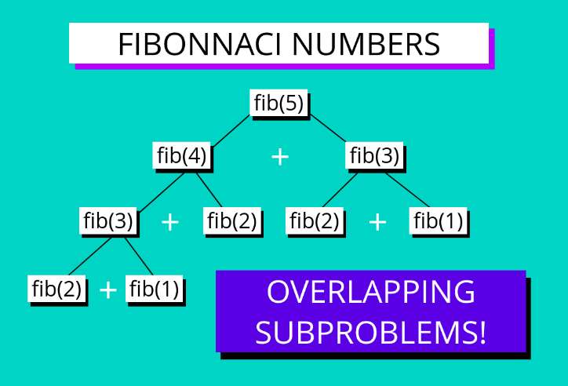

But this tree can grow big, very rapidly.


The big O complexity of this solution is 2^n. Actually it is (1.62^n). Remember 1.62, ***the Golden ratio***.

How bad is 1.62^n. 

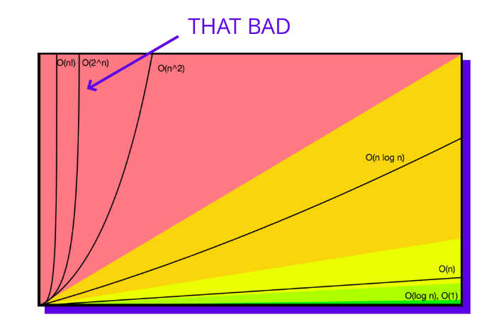

This is a classic example of a problem that can be solved using Dynamic programming, since it has overlapping subproblems.

**What is not a good problem to solve using DP?**

Consider, merge sort. The subproblems in merge sort are not reproducable. Hence, it is not a good candidate for DP.

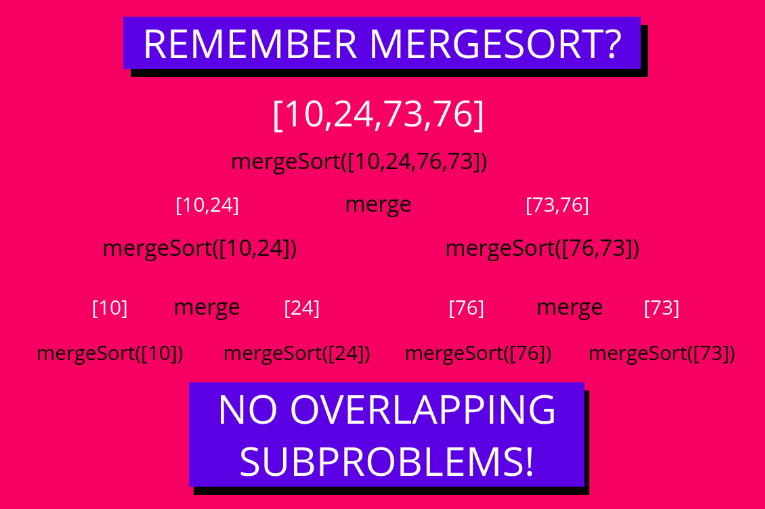

**How can we improve the solution?**

We're repeating things. We can use the results of the sub-problems calculated earlier.

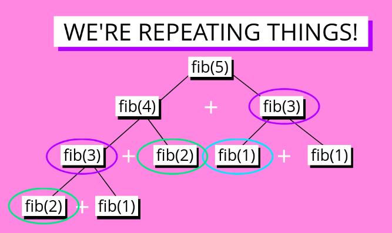
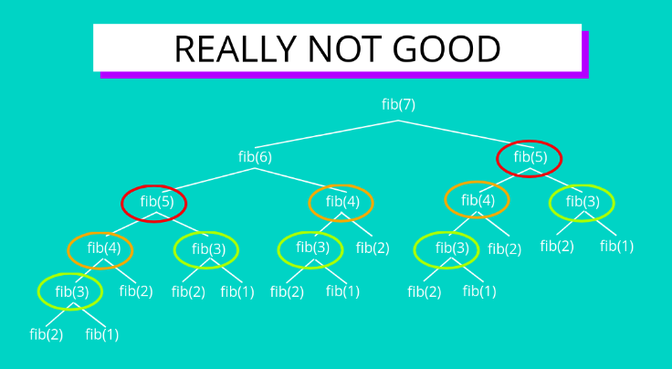

There are 2 ways of caching or storing the results of the subproblems, they are called :

1. Memoization
2. Tabulation


### Memoization

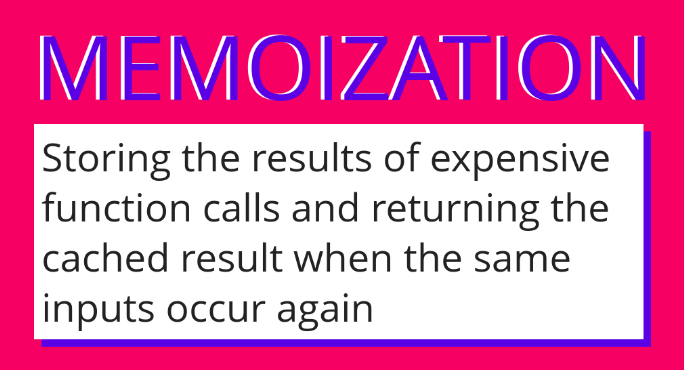
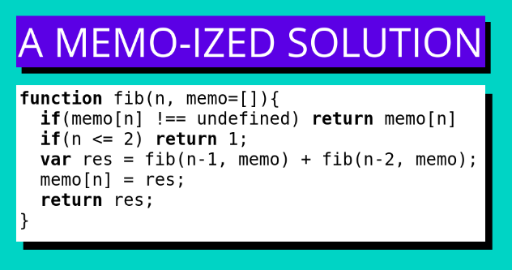
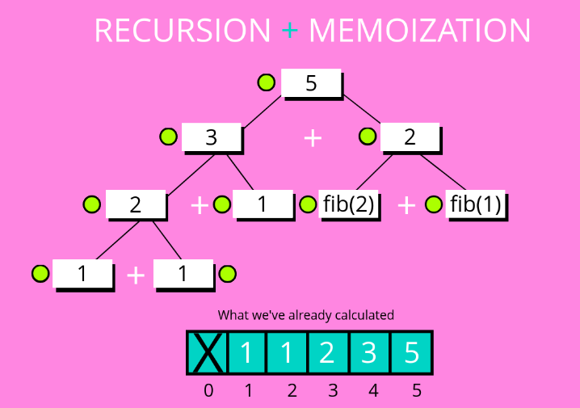

**Big O complexity - O(N)**

### Tabluation

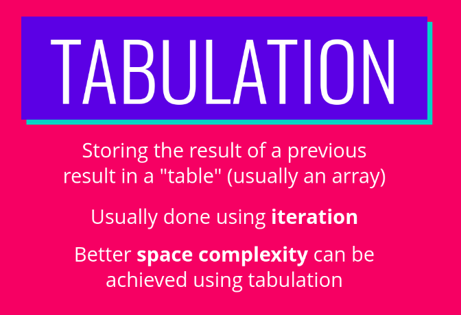

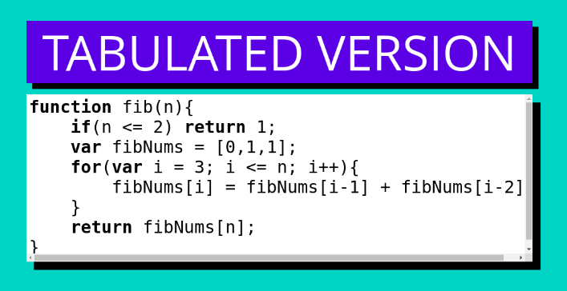

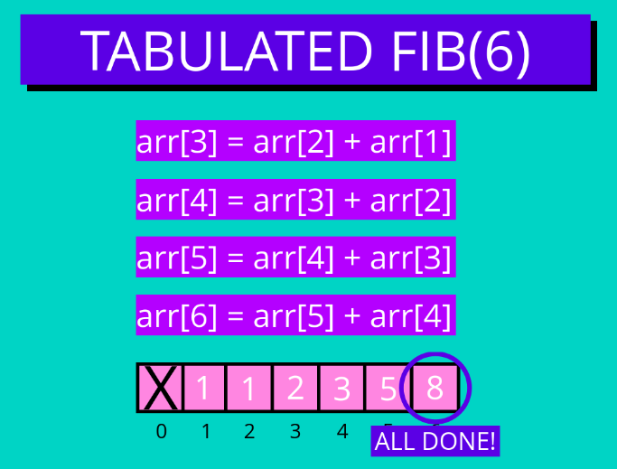

## N-stairs problem

Write a function called **stairs** which accepts n number of stairs. Imagine that a person is standing at the bottom of the stairs and wants to reach the top and the person can climb either 1 stair or 2 stairs at a time. Your function should return the number of ways the person can reach the top by only climbing 1 or 2 stairs at a time.

### Thought-process
Start with something simple. Like, N = 1.

- For **N = 1**, there is 1 way to reach the top. **{1}**
- For **N = 2**, there are 2 ways to reach the top, **{1,1}, {2}**
- Now for N = 3, we can sum the N(2) and N(1).
  So, the **recurrence relation** would be -
  ***Staris(N) = Stairs(N-1) + Stairs(N-2)***

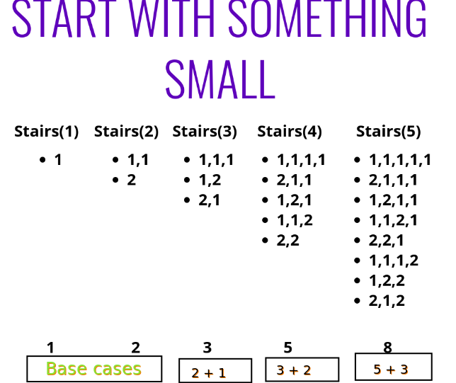

***Note*** - Although this gives us the optimal solution, one thing to note is that the actual combination for each N are different. This will only help us, if we want to get overall count.

### Solutions 

#### Brute force
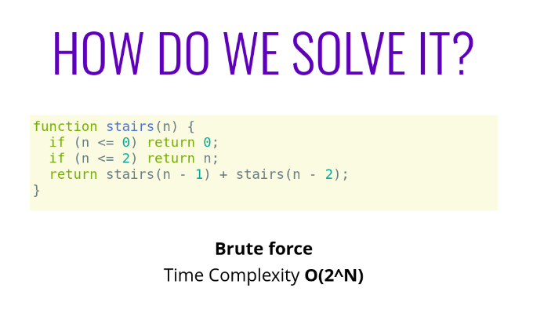

#### Memoized
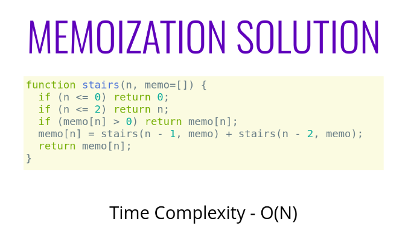

#### Tabulation

```
// Write a function called **stairs** which accepts n number of stairs. 
// Imagine that a person is standing at the bottom of the stairs 
// and wants to reach the top and the person can climb 
// either 1 stair or 2 stairs at a time. 
// Your function should return the number of ways 
// the person can reach the top by only climbing 1 or 2 stairs at a time.


function stairs(n){
  if(n == 1)
    return 1;
  
  if(n == 2)
    return 2;
  
  var tabulation = [1,2];
  
  for(var i = 2; i < n; i++){
    tabulation[i] = tabulation[i - 1] + tabulation[i - 2]; 
  }
  
  return tabulation[n-1];
}

// Time complexity - O(n)
// Space complexity - O(1)
```

### Memoization vs Tabulation
1. For large values of N, memoization will run into stack overflow problems.
2. Space complexity of tabulation is better, than memoization (O(n)).

## USING LISTS AND MATRICES TO BREAK DOWN PROBLEMS

### Coin change problem

Write a function called **coinChange** which accepts two parameters: an array of denominations and a value. The function should return the number of ways you can obtain the value from the given collection of denominations. You can think of this as figuring out the number of ways to make change for a given value from a supply of coins.

