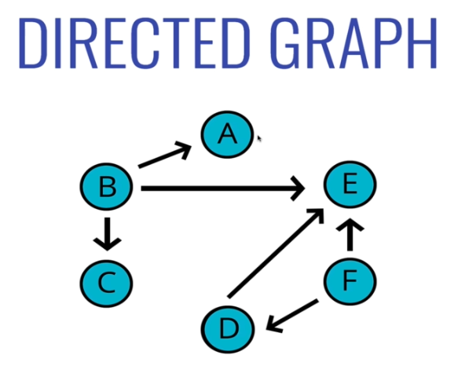
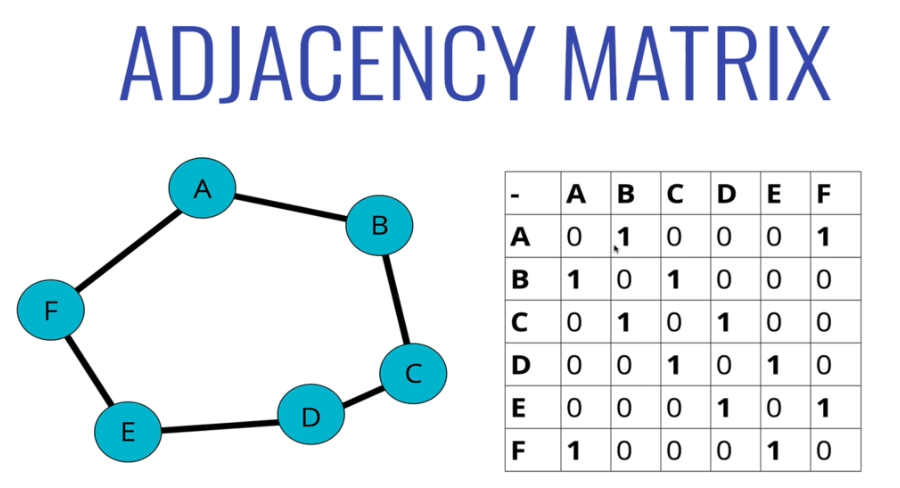
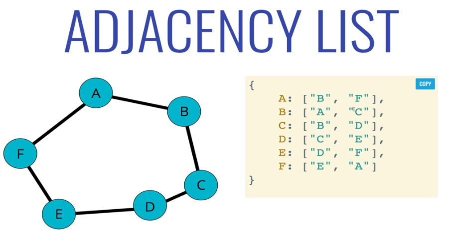
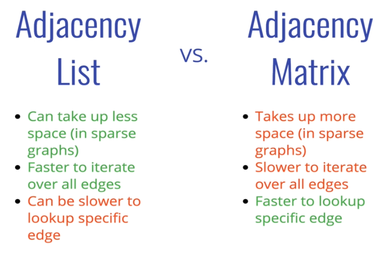
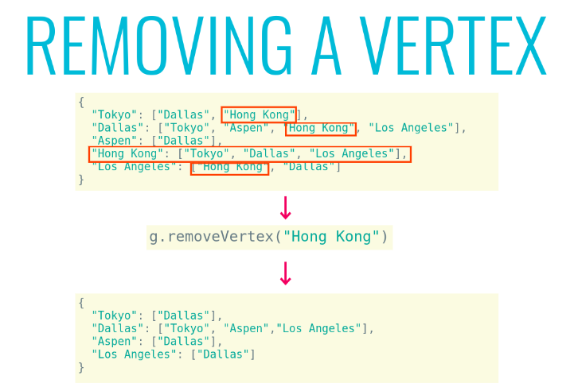
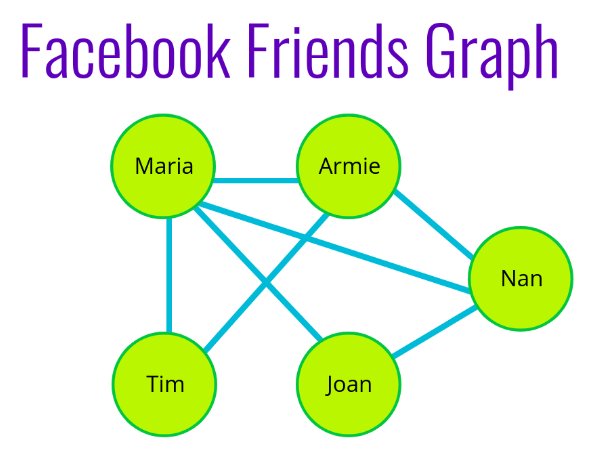
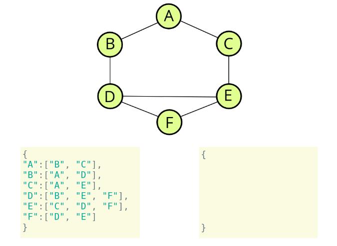
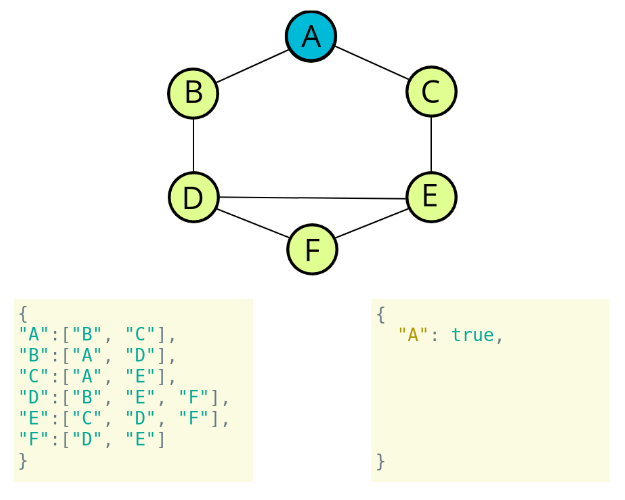
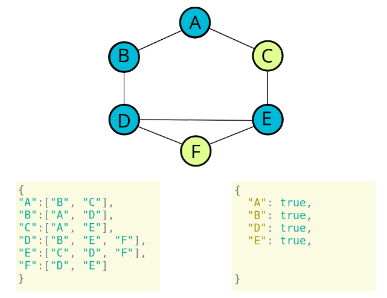

# Graphs

A graph data structure consists of a finite (and possibly mutable) set of vertices or nodes or points, together with a set of unordered pairs of these vertices for an undirected graph or a set of ordered pairs for a directed graph.

Basically, it's just a collection of nodes and connections.

Used in - 
1. Social Networks
2. Location / Mapping
3. Routing Algorithms
4. Visual Hierarchy
5. File System Optimizations
6. EVERYWHERE!

## Terminology

- **Vertex** - a node
- **Edge** - connection between nodes
- **Weighted/Unweighted** - values assigned to distances between vertices
- **Directed/Undirected** - directions assigned to distanced between vertices

## Undirected Graphs

In undirected graphs, there is no polarity to edges. For example, Facebook. If 2 people are friends, they both share each others content, it's mutual.


## Directed graph

In directed graphs, there is a direction associated between any two connected nodes. In below diagram, A and B are connected, we can go from B to A, **but not vice-versa**.



For example, Instagram or Twitter. People follow others, but the people they follow, might not follow them back.


**Facebook is a undirected graph, Instagram, Twitter are directed graphs**

## Weighted graph

Weighted graph is the one in which each edge has a weight associated with it.


## Un-Weighted graph

As the name suggests, the edges do not have a weight associated.

## How do we represent information in graphs?

### Adjacency Matrix



- **1** - Represents a connection between any two nodes.
- **0** - Represents no connection.

- **A - B** is 1
- **B - A** is also 1, representing that this is an undirected graph. **Directed graph will not necessarly have a connection both ways.**

### Adjacency list


If we want to find the nodes connected to node 3 for example, 
- we can go to the 3rd index
- there we can find the nodes connected to 3.

This implementation was easy, but it has flaws:-
1. It worked well, since the nodes were numbers, but they could be anything, strings, letters, complex objects.
2. Even for number implementation, if there are huge gaps in numbers, we will have a lot of empty elements in the array/list.

### Better approach



Adjaency list can take advantage of **hash table**, by storing 
- the value of node as a key 
- and connected nodes as value of hash table.

In this example, we look for "A", and that gives us the nodes connected to "A".

### Big O comparison of Adjacency matrix and Adjacency list.


- For Adding a new node, we need to add a new row and new column to Adjacency Matrix, it is therefore O(V^2), since it is a 2-dimentional structure.
- Whereas for adjacency list, it's just adding a new key-value pair.

More key diffrences below - 



## Operations

1. Add Node/vertex
    - Simple, just add a key-value pair to the HashMap, with key as value of node, and value as an empty array.

```
graph.addVertex("Tokyo")
{
    "Tokyo": []
}
```

2. Add edge between 2 nodes/vertices.
    - This function should accept two vertices, we can call them vertex1 and vertex2
    - The function should find in the adjacency list the key of vertex1 and push vertex2 to the array
    - The function should find in the adjacency list the key of vertex2 and push vertex1 to the array

```
{
  "Tokyo": [],
  "Dallas": [],
  "Aspen": []
}
        |
        |
        |
        V

g.addEdge("Tokyo", "Dallas")

        |
        |
        |
        V

{
  "Tokyo": ["Dallas"],
  "Dallas": ["Tokyo"],
  "Aspen": []
}

        |
        |
        |
        V

g.addEdge("Dallas", "Aspen")

        |
        |
        |
        V

{
  "Tokyo": ["Dallas"],
  "Dallas": ["Tokyo", "Aspen"],
  "Aspen": ["Dallas"]
}
```

3. Removing an edge
    - This function should accept two vertices, we'll call them vertex1 and vertex2
    - The function should reassign the key of vertex1 to be an array that does not contain vertex2
    - The function should reassign the key of vertex2 to be an array that does not contain vertex1

```
g.removeEdge("Tokyo", "Dallas")
 
        |
        |
        |
        V

{
  "Tokyo": ["Dallas"],
  "Dallas": ["Tokyo", "Aspen"],
  "Aspen": ["Dallas"]
}
 
        |
        |
        |
        V

{
  "Tokyo": [],
  "Dallas": ["Aspen"],
  "Aspen": ["Dallas"]
}
```

4. Remove vertex
    - The function should accept a vertex to remove
    - The function should loop as long as there are any other vertices in the adjacency list for that vertex
    - Inside of the loop, call our removeEdge function with the vertex we are removing and any values in the adjacency list for that vertex
    - delete the key in the adjacency list for that vertex
  
  

## Graph traversals

    - Peer to peer networking
    - Web crawlers
    - Finding "closest" matches/recommendations
    - Shortest path problems
        - GPS Navigation
        - Solving mazes
        - AI (shortest path to win the game)

### Use cases 

Graphs are widely used in recommendation engines. Let's look at the example below,

Let's say we have a graph like this, and we want to recommend movies to a user based on genre. User who likes movie 'Halo', can be recommended 'Borderlands', since they have common genres.


Another example, Let's say we want to give friend recommendations

Maria is friends with Nan. Armie is also friends with Nan. 

Both Maria and Armie are also friends with Tim. So it is very likely that Tim is also friends with Nan. 



## DEPTH FIRST TRAVERSAL 

A Graph, unlike a Tree does not have a root. We therefore have to remember the nodes we have visited. 

Below illustration, can help visualize DFS.


### Steps (Recursive)
    - The function should accept a starting node
    - Create a list to store the end result, to be returned at the very end
    - Create an object to store visited vertices
    - Create a helper function which accepts a vertex
        - The helper function should return early if the vertex is empty
        - The helper function should place the vertex it accepts into the visited object and push that vertex into the result array.
        - Loop over all of the values in the adjacencyList for that vertex
        - If any of those values have not been visited, recursively invoke the helper function with that vertex
    - Invoke the helper function with the starting vertex
    - Return the result array

### PSUDOCODE








```
/// DFS Recursive
dfs_recursive(startingNode: string): any {
        const result = [];
        const visited = [];
        const adjacencyList = this.adjacencyList; // Gotcha

        (function dfs(vertex: string) {
            if(!vertex)
                return null;
            
            visited[vertex] = true;
            result.push(vertex);

            adjacencyList[vertex].forEach(neighbor => {
                if(!visited[neighbor])
                    return dfs(neighbor);
            });

        })(startingNode);

        return result;
    }
```
### Steps (Iterative)

    - The function should accept a starting node
    - Create a stack to help use keep track of vertices (use a list/array)
    - Create a list to store the end result, to be returned at the very end
    - Create an object to store visited vertices
    - Add the starting vertex to the stack, and mark it visited
    - While the stack has something in it:
        - Pop the next vertex from the stack
        - If that vertex hasn't been visited yet:
            - ​Mark it as visited
            - Add it to the result list
            - Push all of its neighbors into the stack
    - Return the result array

```
DFS-iterative(start):
    let S be a stack
    S.push(start)
    while S is not empty
        vertex = S.pop()
        if vertex is not labeled as discovered:
            visit vertex (add to result list)
            label vertex as discovered
            for each of vertex's neighbors, N do 
                S.push(N)
```
**In case of recursive solution, we maintain the to-be-visited nodes on a call stack. In iterative solution, we maintain it onto a stack** 

**The order in which we get the result in Recursive and iterative version is opposite to each other.**

## BREADTH FIRST TRAVERSAL

<We'll come back to this>
