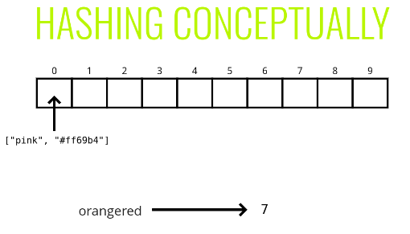
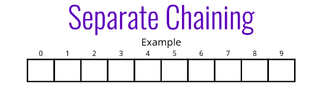
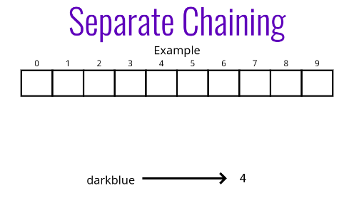
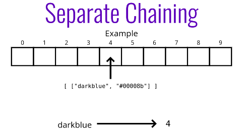

# Hash tables

Hash tables are used to store key-value pairs. They are like arrays, but the keys are not ordered.

Unlike arrays, hash tables are fast for all of the following operations: finding values, adding new values, and removing values!

Nearly every programming language has some sort of hash table data structure. Because of their speed, hash tables are very commonly used!

Hash tables maps keys to objects. The underlying data structures in a has table is an array. When we pass in a key to a has table, it converts that key into an index that can be used to access the object which is stored in the array.

The important key here is the **HASH FUNCTION** which translates a key into an index, during retrievel and insert.

Below are the characteristics of a HASH FUNCTION - 

1. Fast (i.e. constant time)
2. Doesn't cluster outputs at specific indices, but distributes uniformly
3. Deterministic (same input yields same output)

Prime numbers are good friends of hash functions. They help in uniform distribution of hashes. This is a research topic.

When hash functions produce same index for 2 or more different set of inputs, it leads to **Collisions**.

There are 2 ways to address collisions:
1. Linear probing.
2. Separate chaining.

#### Separate chaining

With separate chaining, at each index in our array we store values using a more sophisticated data structure (e.g. an array or a linked list).

This allows us to store multiple key-value pairs at the same index.

#### Operations with separate chaining

1. set
    - Accepts a key and a value
    - Hashes the key
    - Stores the key-value pair in the hash table array via separate chaining
2. get
    - Accepts a key
    - Hashes the key
    - Retrieves the key-value pair in the hash table
    - If the key isn't found, returns undefined

#### Linear probing

With linear probing, when we find a collision, we search through the array to find the next empty slot.

Unlike with separate chaining, this allows us to store a single key-value at each index.

