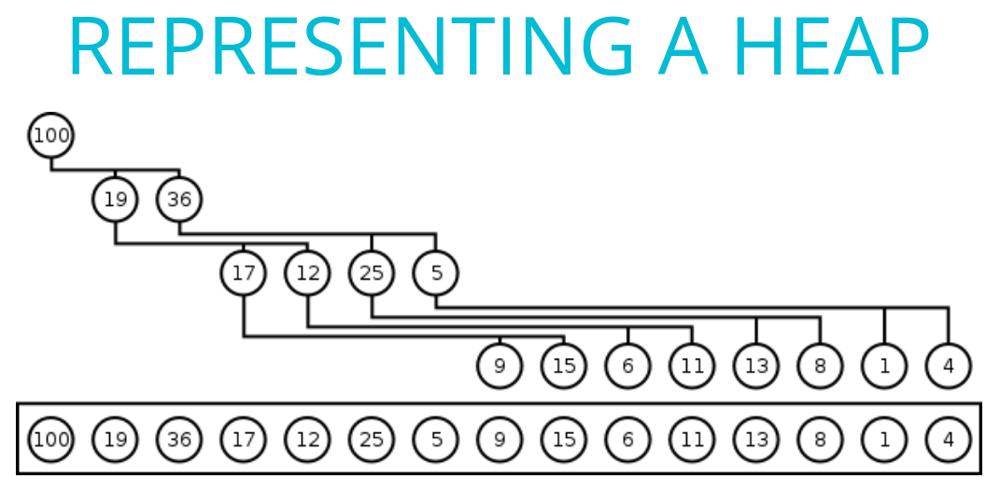
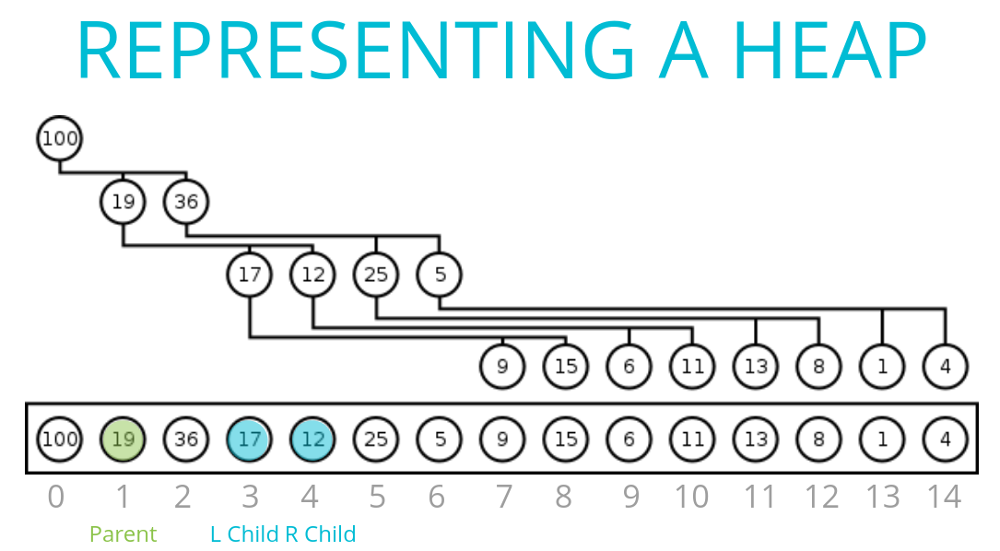
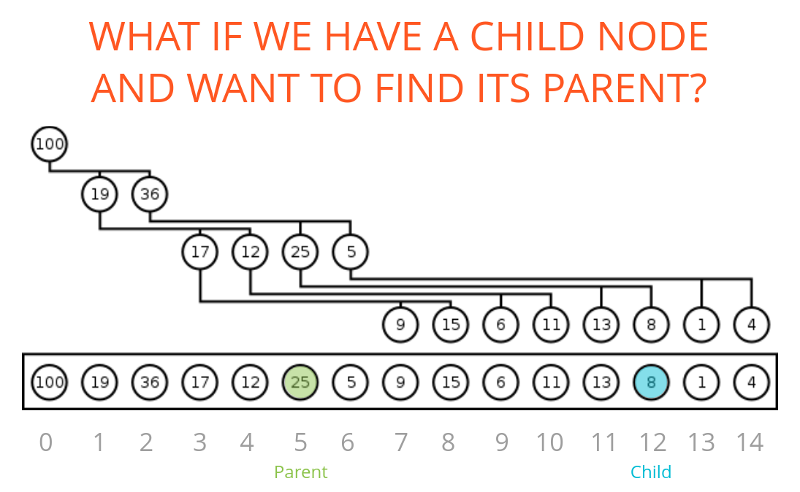
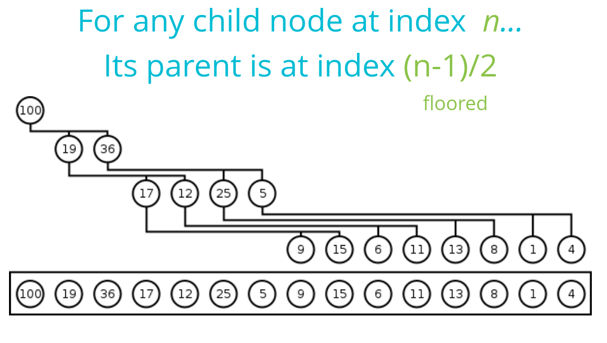
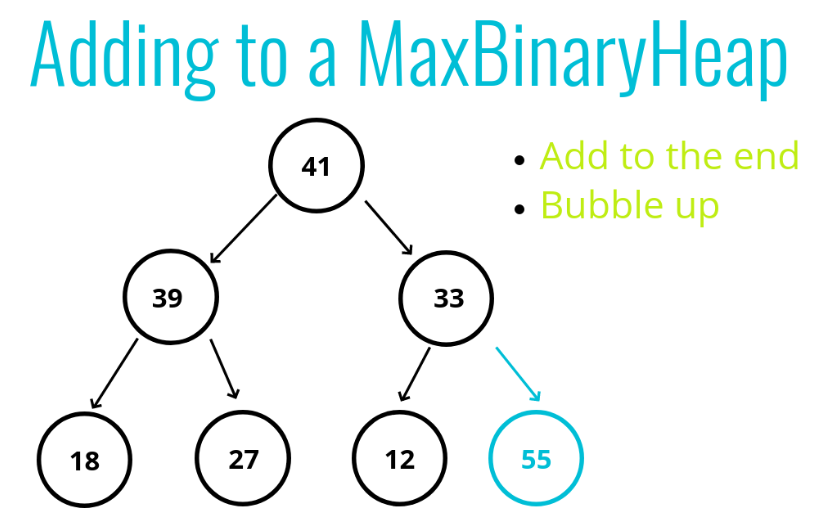
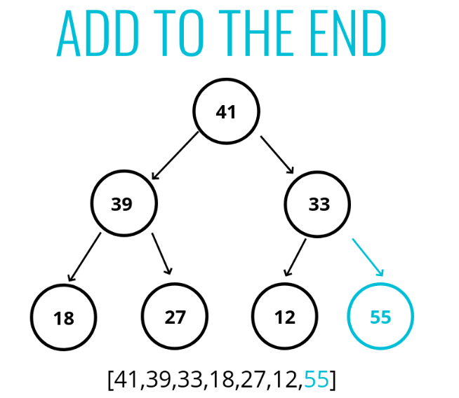
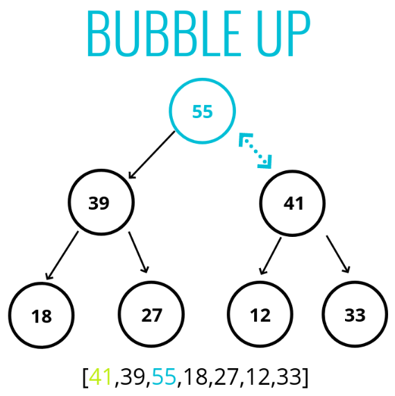
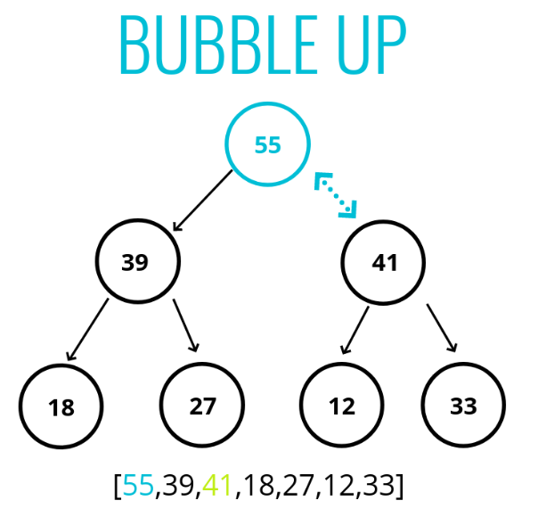

# Binary heaps

Very similar to a binary search tree, but with some additional rules!
1. In a MaxBinaryHeap, parent nodes are always larger than child nodes. 
2. In a MinBinaryHeap, parent nodes are always smaller than child nodes

## Max Binary Heap

1. Each parent has at most two child nodes
2. The value of each parent node is always greater than its child nodes
3. In a max Binary Heap the parent is greater than the children, but there are no guarantees between sibling nodes.
4. A binary heap is as compact as possible. All the children of each node are as full as they can be and left children are filled out first

Example - 
**Max binary Heap** - 

## Min binary heaps

Example - 

## Why heaps?

1. Binary Heaps are used to implement Priority Queues, which are very commonly used data structures

2. They are also used quite a bit, with graph traversal algorithms

## Data model

Binary heaps are usually represented using an Array or Linked list data structure.

## Adding to a Max binary heap

### PSEUDO CODE

- Push the value into the values property on the heap
- Bubble the value up to its correct spot!
- Create a variable called index which is the length of the values property - 1
- Create a variable called parentIndex which is the floor of (index-1)/2
- Keep looping as long as the values element at the parentIndex is less than the values element at the child index
    - Swap the value of the values element at the parentIndex with the value of the element property at the child index
    - Set the index to be the parentIndex, and start over!

## Extract Max, Remove element from heap.
This operation has many names. 
Wiki says, The procedure for deleting the root from the heap (effectively extracting the maximum element in a max-heap or the minimum element in a min-heap) and restoring the properties is called down-heap (also known as bubble-down, percolate-down, sift-down, trickle down, heapify-down, cascade-down, and extract-min/max).

### Operation

### PSEUDO CODE
- Swap the first value in the values property with the last one
- Pop from the values property, so you can return the value at the end.
- Have the new root "sink down" to the correct spot...​
    - Your parent index starts at 0 (the root)
    - Find the index of the left child: 2 * index + 1 (make sure its not out of bounds)
    - Find the index of the right child: 2 * index + 2 (make sure its not out of bounds)
    - If the left or right child is greater than the element...swap. If both left and right children are larger, swap with the largest child.
    - The child index you swapped to now becomes the new parent index.  
    - Keep looping and swapping until neither child is larger than the element.
    - Return the old root!
